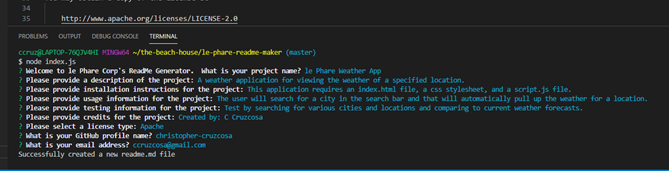

# le Phare ReadMe Generator

## Description 
A simple ReadMe generator via CLI.
         
## Installation
This application requires an index.js file and installion of the package.json dependencies.
          
## Usage 
The user answer a series of prompts realted to the project and their contact info, which will then create a readme.md file based on the answers.

A short video walkthrough is located here: https://www.youtube.com/watch?v=mOum_i4Dmh4&feature=youtu.be

Also, below is a screenshot of the prompts and a success message upon creating a new readme - all on the command line interface.

The project exists on this GitHub repo but is not currently deployed.
          
## Credits
Created by: C Cruzcosa
          
## License
Copyright (c) [2020] [Christopher Cruzcosa]

Permission is hereby granted, free of charge, to any person obtaining a copy of this software and associated documentation files (the "Software"), to deal in the Software without restriction, including without limitation the rights to use, copy, modify, merge, publish, distribute, sublicense, and/or sell copies of the Software, and to permit persons to whom the Software is furnished to do so, subject to the following conditions:

The above copyright notice and this permission notice shall be included in all copies or substantial portions of the Software.

THE SOFTWARE IS PROVIDED "AS IS", WITHOUT WARRANTY OF ANY KIND, EXPRESS OR IMPLIED, INCLUDING BUT NOT LIMITED TO THE WARRANTIES OF MERCHANTABILITY, FITNESS FOR A PARTICULAR PURPOSE AND NONINFRINGEMENT. IN NO EVENT SHALL THE AUTHORS OR COPYRIGHT HOLDERS BE LIABLE FOR ANY CLAIM, DAMAGES OR OTHER LIABILITY, WHETHER IN AN ACTION OF CONTRACT, TORT OR OTHERWISE, ARISING FROM, OUT OF OR IN CONNECTION WITH THE SOFTWARE OR THE USE OR OTHER DEALINGS IN THE SOFTWARE.